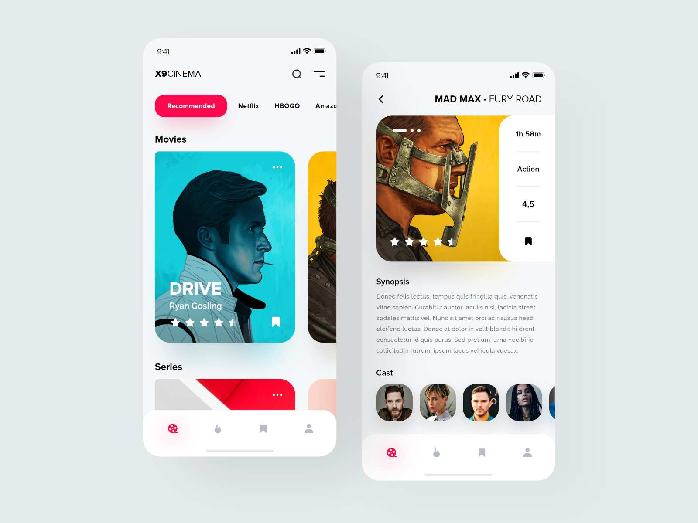

# X9CINEMA Application 🎬📲 UI

Flutter UI Rapid Prototyping - Day 09/10

Design Credit: [Manuel Rovira for Orizon](https://dribbble.com/shots/10837067-X9CINEMA-Application)

Speed Code YouTube Video: https://youtu.be/XWERSfMBjWQ

## Getting Started

This project is a starting point for a Flutter application.

A few resources to get you started if this is your first Flutter project:

- [Lab: Write your first Flutter app](https://flutter.dev/docs/get-started/codelab)
- [Cookbook: Useful Flutter samples](https://flutter.dev/docs/cookbook)

For help getting started with Flutter, view our
[online documentation](https://flutter.dev/docs), which offers tutorials,
samples, guidance on mobile development, and a full API reference.
